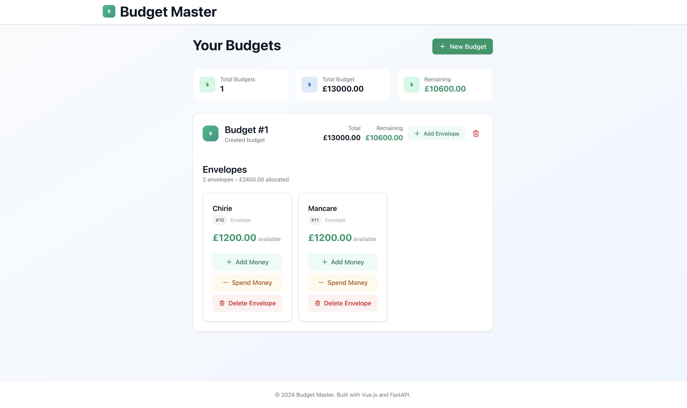

# Budget Master 💰

A modern envelope budgeting application built with Vue.js 3 and FastAPI. Manage your finances by allocating money into different spending categories (envelopes) and track your expenses in real-time.



## ✨ Features

- **Multiple Budgets**: Create and manage multiple budget plans
- **Envelope Budgeting**: Organize spending into categorized envelopes
- **Real-time Updates**: Add or spend money with instant feedback
- **Modern UI**: Clean, responsive interface built with TailwindCSS
- **Toast Notifications**: User-friendly feedback for all actions
- **Database Persistence**: SQLite database for reliable data storage

## 🛠️ Tech Stack

### Backend
- **FastAPI**: Modern, fast web framework for building APIs
- **SQLAlchemy**: SQL toolkit and Object-Relational Mapping
- **SQLite**: Lightweight database for data persistence
- **Pydantic**: Data validation using Python type annotations

### Frontend
- **Vue.js 3**: Progressive JavaScript framework with Composition API
- **Pinia**: Official state management for Vue.js
- **TailwindCSS**: Utility-first CSS framework
- **Vite**: Fast build tool and development server

## 🚀 Quick Start

### Prerequisites

- Python 3.8+
- Node.js 16+
- npm or yarn

### Installation

1. **Clone the repository**
   ```bash
   git clone <your-repo-url>
   cd budgeting-app
   ```

2. **Set up the Backend**
   ```bash
   cd backend

   # Install Python dependencies
   pip install fastapi uvicorn sqlalchemy databases aiosqlite pydantic

   # Start the FastAPI server
   uvicorn main:app --reload
   ```
   The API will be available at `http://127.0.0.1:8000`

3. **Set up the Frontend**
   ```bash
   cd frontend

   # Install dependencies
   npm install

   # Start the development server
   npm run dev
   ```
   The app will be available at `http://localhost:5173`

## 📖 Usage Guide

### Creating a Budget
1. Click the "Create Budget" button
2. Enter your total budget amount
3. Click "Create Budget" to save

### Managing Envelopes
1. **Add Envelope**: Click "Add Envelope" within a budget
2. **Add Money**: Use the "Add Money" button to allocate funds
3. **Spend Money**: Use the "Spend" button to record expenses
4. **Delete Envelope**: Remove envelopes you no longer need

### Budget Operations
- **Delete Budget**: Remove an entire budget and all its envelopes
- **View Summary**: See total budget and remaining amounts

## 🔧 API Endpoints

### Budget Endpoints
- `GET /api/budget/load` - Get all budgets
- `POST /api/budget/create` - Create a new budget
- `DELETE /api/budget/delete/{budget_id}` - Delete a budget

### Envelope Endpoints
- `GET /api/anvelopes/load/{budget_id}` - Get envelopes for a budget
- `POST /api/anvelopes/create` - Create a new envelope
- `POST /api/anvelopes/add_money/{envelope_id}/{amount}` - Add money to envelope
- `POST /api/anvelopes/spend_money/{envelope_id}/{amount}` - Spend from envelope
- `DELETE /api/anvelopes/delete/{envelope_id}` - Delete an envelope

## 📁 Project Structure

```
budgeting-app/
├── backend/
│   ├── main.py          # FastAPI application entry point
│   ├── models.py        # SQLAlchemy database models
│   ├── schemas.py       # Pydantic schemas for data validation
│   ├── database.py      # Database configuration
│   └── anvelopes.db     # SQLite database file
├── frontend/
│   ├── src/
│   │   ├── components/  # Vue components
│   │   ├── views/       # Main application views
│   │   ├── stores/      # Pinia state management
│   │   └── router/      # Vue Router configuration
│   ├── package.json     # Frontend dependencies
│   └── vite.config.js   # Vite configuration
└── screenshot.png       # Application screenshot
```

## 🎯 Key Components

### Backend Components
- **`main.py`**: API routes and FastAPI application setup
- **`models.py`**: Database table definitions (budgets and envelopes)
- **`schemas.py`**: Data validation schemas
- **`database.py`**: Database connection and configuration

### Frontend Components
- **`App.vue`**: Main application component with layout and toast system
- **`Budgeting.vue`**: Primary view for budget management
- **`Envelopes.vue`**: Component for envelope display and management
- **`budget.js`**: Pinia store for state management


### Building for Production
```bash
# Frontend build
cd frontend
npm run build

# Backend deployment
cd backend
uvicorn main:app --host 0.0.0.0 --port 8000
```

## 📝 License

This project is open source and available under the [MIT License](LICENSE).

## 🔮 Future Enhancements

- [ ] User authentication and authorization
- [ ] Data export/import functionality
- [ ] Budget analytics and reporting
- [ ] Mobile app development
- [ ] Multi-currency support
- [ ] Recurring transactions
- [ ] Budget templates

---

**Built with ❤️ using Vue.js and FastAPI**